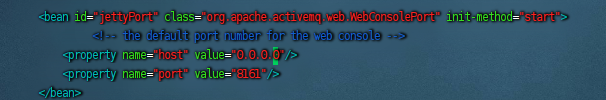
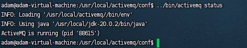
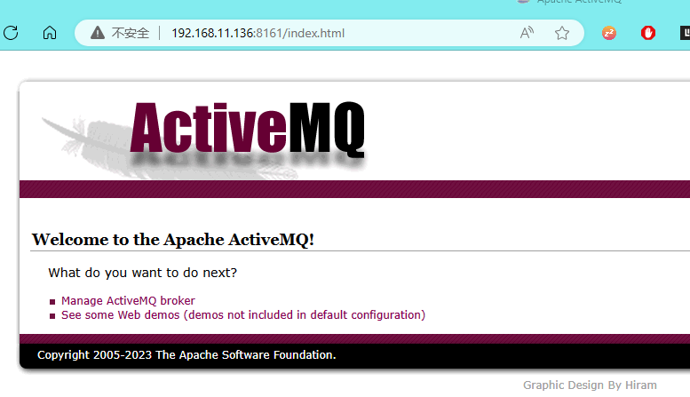

1. 下载ActiveMQ
https://activemq.apache.org/components/classic/download/
针对Ubuntu的版本选择：apache-activemq-5.18.2-bin.tar.gz
需要更高的JDK版本支持， 否则会有异常
   Exception in thread "main" java.lang.UnsupportedClassVersionError: org/apache/activemq/console/Main has been compiled by a more recent version of the Java Runtime (class file version 55.0), this version of the Java Runtime only recognizes class file versions up to 52.0

2. 下载后使用winscp工具移动到相应的Ubuntu serevr上
3. 解压
   sudo tar zxvf apache-activemq-5.18.2-bin.tar.gz -C /usr/local/
4. 把解压好的文件重命名：
   sudo mv /usr/local/apache-activemq-5.18.2/ /usr/local/activemq
5. 把端口开放出来或者关闭防火墙
   开放端口命令：
   firewall-cmd --zone=public --add-port=61616/tcp --permanent
   firewall-cmd --zone=public --add-port=8161/tcp --permanent
   firewall-cmd –-reload

   关闭防火墙命令：
   systemctl stop firewalld
   systemctl stop iptables

6. 启动ActiveMQ ：/usr/local/activemq/bin/activemq start

7. 查看ActiveMQ 是否启动成功：/usr/local/activemq/bin/activemq status

8. 停止ActiveMQ命令 ：/usr/local/activemq/bin/activemq stop

9. 重启ActiveMQ命令 ： /usr/local/activemq/bin/activemq restart

10. 修改后台访问端口
    vim /usr/local/activemq/conf/jetty.xml
    ####到117行这里找到 127.0.0.1 修改为 0.0.0.0

    <bean id="jettyPort" class="org.apache.activemq.web.WebConsolePort" init-method="start">
             <!-- the default port number for the web console -->
        <property name="host" value="0.0.0.0"/>
        <property name="port" value="8161"/>
    </bean>

11. 然后重启

12. 使用windows访问

安装问题：
cannot create /run/activemq.pid: Permission denied

控制台打印分析问题：
./activemq console
